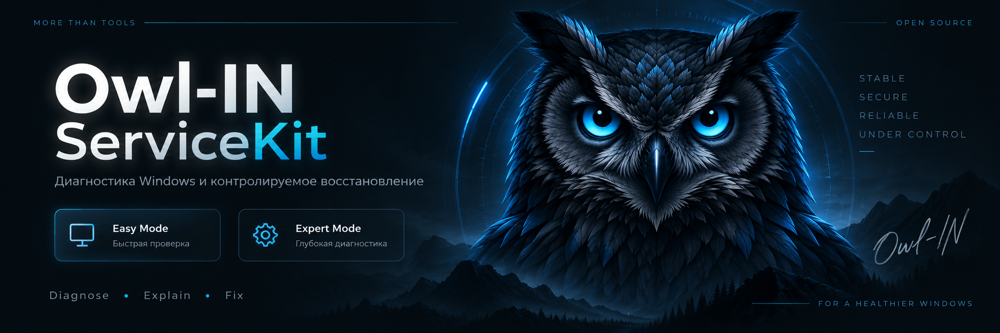
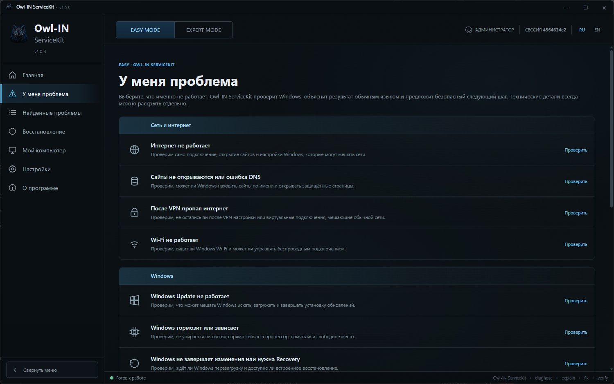
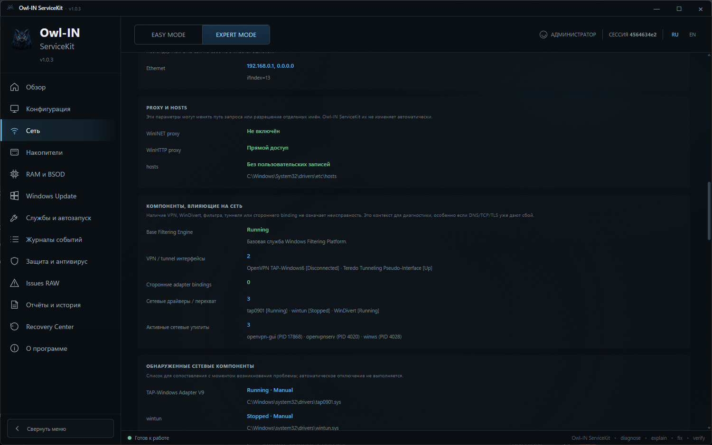

<p align="center">
  
</p>

<p align="center">
  <a href="https://github.com/Owl-IN-ex/Owl-IN-ServiceKit/releases/latest"><strong>Скачать последнюю версию</strong></a>
  ·
  <a href="CHANGELOG.md">История версий</a>
  ·
  <a href="ROADMAP.md">План работ</a>
</p>

# Owl-IN ServiceKit

**Owl-IN ServiceKit** — портативная утилита для диагностики и аккуратного восстановления Windows 10/11. Установка не требуется: релизная сборка распространяется одним EXE.

**Обнаружить → Объяснить → Сохранить состояние → Исправить → Проверить → Откатить**

## Что уже умеет

- быстрый **Quick Scan** компьютера;
- режим **Easy Mode** с понятными сценариями «У меня проблема»;
- режим **Expert Mode** с расширенной технической диагностикой;
- проверка сети, DNS, прокси, VPN/TUN, hosts и компонентов, влияющих на соединение;
- диагностика накопителей, RAM/BSOD, Windows Update, служб, автозапуска и событий Windows;
- анализ подозрительной фоновой активности с учётом процессов, путей, подписи и механизмов автозапуска;
- безопасная изоляция подозрительных объектов с возможностью восстановления;
- действия восстановления с резервированием, проверкой результата и откатом там, где это поддерживается;
- отчёты, история запусков и раздел восстановления;
- запуск из одного EXE без отдельной установки.

## Easy Mode и Expert Mode

**Easy Mode** нужен, когда не хочется разбираться в Event ID, службах, драйверах и реестре. Выбираешь симптом — **Owl-IN ServiceKit** собирает данные, объясняет результат обычным языком и предлагает доступный следующий шаг.

**Expert Mode** показывает технические доказательства и состояние системы подробнее: конфигурацию, сеть, накопители, RAM/BSOD, Windows Update, службы и автозапуск, события, безопасность и RAW-данные.

## Скриншоты

### Easy Mode — «У меня проблема»

<p align="center">
  
</p>

Пользователь выбирает симптом, после чего Owl-IN ServiceKit запускает соответствующую проверку и показывает результат без необходимости вручную разбирать технические данные.

### Expert Mode — «Сеть»

<p align="center">
  
</p>

Технический режим показывает состояние сети, прокси, hosts, VPN/TUN-интерфейсов, сетевых драйверов и других компонентов, которые могут влиять на подключение.

## Текущая версия

**1.0.4** — актуальный стабильный выпуск Owl-IN ServiceKit.

**[Скачать Owl-IN ServiceKit 1.0.4](https://github.com/Owl-IN-ex/Owl-IN-ServiceKit/releases/tag/v1.0.4)**

Проверенный SHA-256 релизного EXE:

```text
f11c27be40cb61e4486b182826841f5c27b5a844c6a091163f51fcf5d722b8c6
```

Готовые EXE не хранятся среди исходников репозитория. Релизные сборки публикуются отдельно через **GitHub Releases**.

## Сборка

Проект использует **.NET 8**, WPF и WebView2. Для локальной сборки под Windows используется `BUILD-EXE.cmd`.

Публичный файл формируется в виде:

```text
Owl-IN-ServiceKit-x.y.z.exe
```

## Документация

- [`CHANGELOG.md`](CHANGELOG.md) — история версий;
- [`ROADMAP.md`](ROADMAP.md) — рабочий список задач, который может меняться по ходу разработки;
- [`SECURITY.md`](SECURITY.md) — подход к безопасности;
- [`docs/architecture.md`](docs/architecture.md) — текущая архитектура;
- [`docs/easy-mode.md`](docs/easy-mode.md) — Easy Mode;
- [`docs/expert-mode.md`](docs/expert-mode.md) — Expert Mode;
- [`docs/release-process.md`](docs/release-process.md) — выпуск релизов;
- [`docs/releases/1.0.4.md`](docs/releases/1.0.4.md) — примечания к текущему выпуску;
- [`docs/website.md`](docs/website.md) — отдельный сайт Owl-IN и его связь с Owl-IN ServiceKit.
